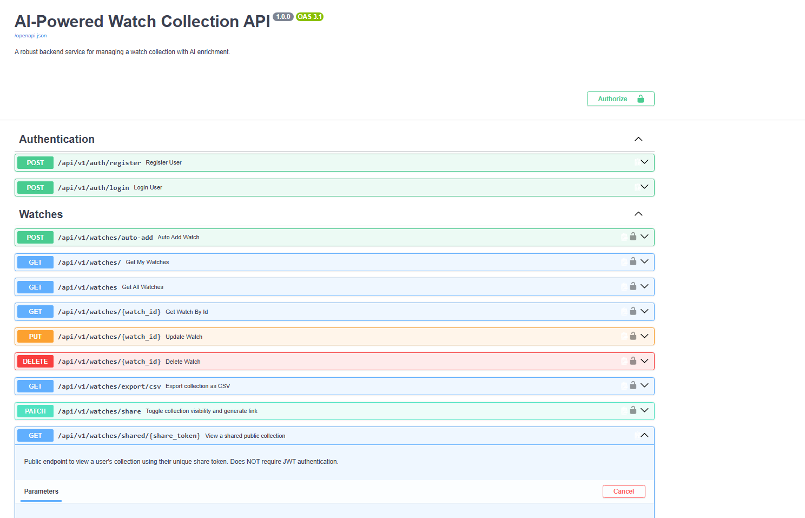

# ⌚ AI-Powered Watch Collection REST API

A modern, robust backend service built with **FastAPI** and **SQLAlchemy**, featuring AI-driven data enrichment via the **Groq LLM (Qwen)**. This API allows users to manage their watch collections, get automated specifications from AI, filter results dynamically, and extract advanced collection statistics.



🔗 **Live Demo (Swagger UI):** [Coming Soon - Will be added after deployment]

## 🚀 Key Features
- **JWT Authentication:** Secure user registration and login flows.
- **AI-Powered Data Extraction:** Uses Groq API to parse natural language (e.g., *"Find me an automatic watch under $1000"*) into structured SQL queries.
- **Advanced Filtering & Pagination:** Robust query parameters for seamless frontend integration (`limit`, `page`, `brand`, `movement`).
- **Data Analytics (SQL Aggregation):** Generates portfolio statistics using `COUNT`, `AVG`, and `GROUP BY` operations.
- **Complex Relationships:** 
  - *Many-to-Many:* Users can add watches to their Favorites.
  - *One-to-Many:* Users can leave 1-5 star ratings and reviews on watches.
- **Data Export:** Export user-specific collection data directly to CSV using Pandas.

## 🛠️ Tech Stack
- **Framework:** FastAPI, Pydantic v2
- **Database:** SQLite (SQLAlchemy ORM)
- **Migrations:** Alembic
- **AI Integration:** Groq API (qwen3.8-27b)
- **Security:** Passlib (Bcrypt), python-jose (JWT)

---

## 💻 Local Setup & Installation

Follow these steps to run the project locally on your machine.

### 1. Clone the repository
```bash
git clone [https://github.com/Chagr1/AI-Powered-Watch-Collection-API.git](https://github.com/Chagr1/AI-Powered-Watch-Collection-API.git)
cd AI-Powered-Watch-Collection-API